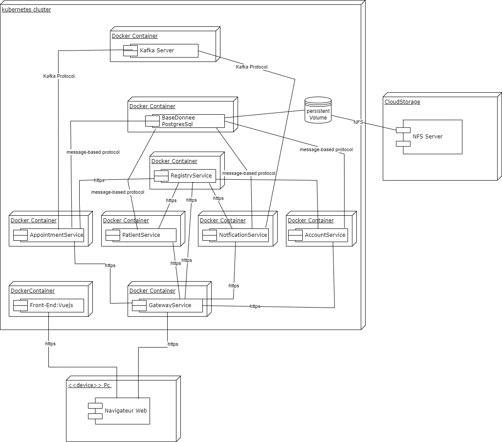

# kubernetes
Kubernetes Configurations for MyProject  This repository contains a collection of YAML files that define the Kubernetes configurations for deploying and managing the infrastructure of MyProject. These configurations include deployments, services,  rules, and other resources required to run MyProject in a Kubernetes cluster.
### This image represents the deployment diagram for MyProject 

